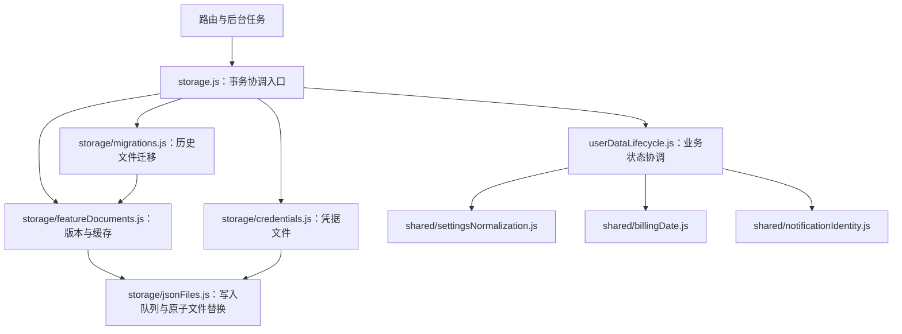

# 模块职责与数据边界

本次重组沿用 React、Express 和 JSON 文件存储，不改变现有数据目录布局、schemaVersion 或公开 API 路径。

## 存储与业务状态



- `storage.js` 负责协调用户级队列、读文档、调用领域规则、比较变化并提交 revision。对外继续提供 `loadUserData`、`updateUserData`、`updateUserFeature`。
- `storage/jsonFiles.js` 只处理目录权限、JSON 文件读写、临时文件清理和进程内串行队列。文件通过临时文件重命名替换。
- `storage/featureDocuments.js` 管理文档格式、revision 和缓存；读取、缓存与返回值之间通过复制隔离。
- `storage/migrations.js` 负责旧单文件迁移。已存在的功能文件优先，只有缺失文件才从旧数据补齐；全部写入成功后删除旧文件。中断后可再次执行。
- `storage/credentials.js` 独立管理管理员凭据，不参与订阅状态规则。
- `userDataLifecycle.js` 是可注入时间的纯函数：同一时间快照下先推进订阅账期，再处理通知保留期、兼容清理及续订反馈，最后规范化设置。

`loadUserData` 为兼容现有调用，仍会在返回前持久化必要的账期和通知维护结果。业务规则已经从文件读写实现中分离，统一由 `withUserDocuments` 调用。普通读取没有数据变化时不增加 revision；显式功能写入保持原有递增规则。

写入保证仍是**单个功能文件的原子替换与单进程串行协调**，并非跨文件数据库事务。部署应保持单后端实例写入同一数据目录。

## 通知发送

`reminders.js` 只负责续订筛选、月度统计、消息构造和调度；两类通知都使用 `notificationDelivery.js`。

共用流程如下：

1. 在用户写入队列中复核订阅/规则/通道条件并查重。
2. 新建或复用记录，持久化 `deliveryState: attempting`。
3. 持久化成功后才调用 Telegram 或邮件通道。
4. 将结果记为 `delivered`、`failed` 或 `unknown`，保存完成时间及脱敏错误。

`attempting`、`delivered` 和 `unknown` 都阻止重复发送。Telegram 超时或请求失败可能已经送达，因此记为 `unknown`；明确发送失败才允许后续重试。发送成功但结果落盘失败时，原 `attempting` 记录继续阻止自动重发。

领域差异通过 `canClaim`、`findExisting`、记录内容和 `send` 回调传入；查重条件与账单统计不放入通用发送器。

## 设置所有权

| 类型 | 内容 | 写入路径 |
| --- | --- | --- |
| `ClientPreferences` | 语言、主题、配色 | `useClientPreferences` → 浏览器 localStorage |
| `EditableSettings` | 壁纸、自定义列表、币种列表、通知配置 | `EditableSettingsPatch` → `PUT /api/settings` |
| `ServerSettingsState` | 部署时区、汇率与更新时间、汇率配置状态、2FA 状态 | 服务端任务及专用接口 |
| `RemoteSettings` | 可编辑配置与公开服务端状态 | 前端远端数据源 |
| `AppSettings` | 远端设置叠加设备偏好的组件视图 | 只用于展示，不作为更新协议 |
| `StoredSettings` | 兼容的磁盘结构，包含服务端私有凭据 | 仅服务端持久化 |

`shared/settingsNormalization.js` 统一默认值、旧模板及旧通知通道格式的兼容规则。前端只额外做显示标签的规范化。

`shared/settingsOwnership.js` 定义字段归属、公开投影和补丁合并。`server/lib/settingsPolicy.js` 集中执行所有权限制、完整状态校验和响应投影。TOTP 密钥及汇率密钥密文不进入公开设置响应；2FA 初始化时，待绑定密钥仅通过该专用接口单独返回。

### 普通设置更新

接口继续使用 `PUT /api/settings` 与 `If-Match`。新前端只提交实际变更的字段，例如：

```json
{ "notifications": { "rules": { "monthlySummary": true } } }
```

配置对象按字段合并，数组整体替换；未提交的相邻字段保留。合并后的完整设置仍经过既有校验。旧版完整 PUT 继续接受，但其中的本地偏好和服务端维护字段不参与更新，未知顶层字段返回 400。

`useAppData` 负责乐观更新、串行保存和 revision。409 后加载权威数据并提示核对草稿，不自动换版本重发。刷新使用 mutation version 和在途写入计数，避免旧响应覆盖新状态。

### 专用设置更新

2FA 和汇率专用接口统一增加：

```text
settingsState: ServerSettingsState
revision: number
```

专用 Hook 通过 `ServerSettingsUpdate` 将响应交回 `useAppData`，不维护长期的局部状态覆盖。旧响应不能降低共享 revision；存在排队写入时不会用专用接口的新 revision 授权旧写入，而是在队列结束后重新同步。旧接口的成功标记及汇率 `settings` 字段保留。

## 验证位置

- `server/test/storageArchitecture.test.js`：迁移中断恢复、已有文件优先、写入冲突、缓存隔离。
- `server/test/userDataLifecycle.test.js`：同一时间快照、推进账期后更新反馈、保留期及幂等性。
- `server/test/notificationDelivery.test.js`：两类通知的并发领取、发送前落盘失败、超时和完成结果落盘失败。
- `server/test/settingsPolicy.test.js`：嵌套补丁、只读字段保护、公开状态与私有凭据边界。
- `test/settingsOwnership.test.ts` 与 `test/reviewRegressions.test.tsx`：客户端发送边界、连续补丁、过期专用响应及既有并发回归。
